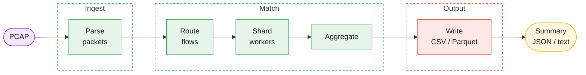
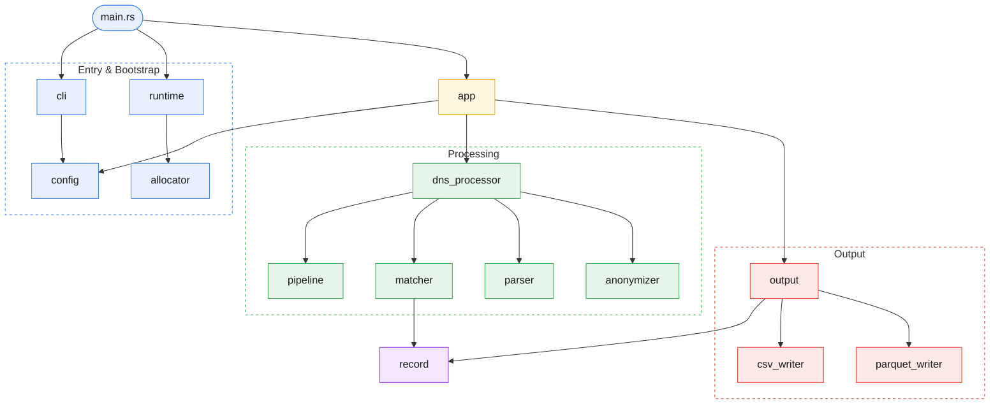

# DPP Architecture

## Scope

This document is the canonical architecture reference for the DPP Community Edition. It records the
processing model, ownership boundaries, and matcher invariants that must remain true across bug
fixes, performance work, and future refactors.

## Processing Model

DPP Community Edition has a single supported matching model:

- forward-only matching with deterministic ordering by `(timestamp_micros, packet_ordinal)`
- offline processing from PCAP input into CSV or Parquet output
- optional final JSON run summary through the canonical report-format contract; stdout export mode
  is CSV-only, rejects JSON reports, suppresses text reports, and signal-driven shutdown drops any
  still-buffered output tail before final writer teardown
- optional `--monotonic-capture` mode for globally ordered captures

The matcher is the authoritative owner of in-flight query/response state. Parsing may run in
parallel, but matching decisions must be applied in a deterministic order.

## Pipeline

The processing pipeline has four logical stages:

1. Packet ingestion and ordering
   Reads packets from an offline PCAP file and establishes deterministic packet order inside each
   batch.

2. DNS extraction
   Parses Ethernet/IP/UDP payloads and builds DNS query/response candidates.

3. Query-response matching
   Holds in-flight query/response state, applies timeout windows, deduplicates retries, and emits
   exactly one terminal outcome per canonical query.

4. Record serialization
   Streams matched or timed-out DNS records to CSV or Parquet writers.

In the current multi-threaded implementation, those stages are realized as a bounded batch-prefetch
reader, a lightweight routing stage, shard-owned workers, a deterministic aggregator, and
asynchronous writers. The routing stage performs only cheap L3/L4 extraction, computes a canonical
client/resolver flow key, and hands owned packet batches to the correct worker before full DNS
decode begins. DPP derives its execution budget from all available CPUs; there is no supported
runtime thread-count override. On low-core hosts, DPP falls back to the simpler phase-parallel
pipeline so it does not spend too much of the machine on staged-pipeline service roles. In staged
mode, the runtime reserves two non-worker service threads for routing/aggregation and parser work,
and uses the remaining CPU budget for shard workers. Routed DNS packets also carry compact UDP/DNS
metadata into shard workers so the worker path can reuse the first L3/L4 parse instead of
repeating it for full DNS question decoding.

## Core Components

- `src/packet_parser.rs`
  Reads packets from offline captures and exposes them to the rest of the pipeline. Classic PCAP
  files use a pure-Rust streaming reader; PCAPNG and other non-classic formats currently fall back
  to libpcap. The pure-Rust classic-PCAP reader still relies on the upstream `pcap-file`
  `3.0.0-rc1` release candidate until a stable line with the required functionality is available.
  The parser can also enforce globally monotonic capture timestamps for the optional batched
  timeout-eviction path; when that contract is enabled, a timestamp regression becomes a hard
  processing error instead of a post-run warning.

- `src/config.rs`
  Canonical runtime configuration and processing constants. Output format, report format, batch
  sizing, timeout windows, execution-model thresholds, and writer thresholds must have a single
  source of truth here.

- `src/allocator.rs`
  Canonical global allocator boundary. Build-time allocator selection is owned here through
  mutually exclusive Cargo features and must not leak into CLI, environment parsing, or subsystem
  configuration.

- `src/cli.rs`
  Canonical CLI and environment-resolution boundary. Command-line parsing, environment override
  precedence, and output-path validation must stay centralized here instead of leaking into runtime
  orchestration or module-local helpers.

- `src/record.rs`
  Canonical exported `DnsRecord` contract. Internal matcher discriminators and shard metadata must
  never leak into this type. Timeout records currently encode "no response observed in the match
  window" as `response_timestamp = 0` together with `response_code = ServFail`.

- `src/output.rs`
  Writer lifecycle boundary. Owns output control messages and the writer-thread factory. The
  handoff channel from processing to output is bounded by configuration and must not become
  unbounded ambient state.

- `src/monitor_memory.rs`
  Optional RSS tracking helper with an explicit stop/join lifecycle. The monitor must not detach
  indefinitely from top-level process shutdown.

- `src/dns_processor.rs` and `src/dns_processor/*`
  The DNS processor facade owns packet-to-matcher orchestration and delegates to focused
  submodules: `anonymizer.rs` for key loading and deterministic pseudonymization, `parser.rs` for
  packet-to-DNS extraction and canonical flow routing metadata, `matcher.rs` for in-flight state
  and pairing, `pipeline.rs` for shard-parallel orchestration, and `types.rs` for internal matcher
  types. Signal-driven shutdown semantics for pending unmatched queries are also owned here:
  interrupted runs must not synthesize timeout tail records from incomplete matcher state. The
  staged pipeline may reuse parser-produced UDP/DNS metadata between routing and
  shard-local DNS decode, but that reuse must stay within the same ownership boundary so packet
  parsing does not gain a second source of truth for IP/port extraction. The optional runtime flag
  `--dns-wire-fast-path` may enable a custom question-only wire fast path, but `hickory` remains
  the semantic fallback for rare DNS messages that the fast path does not accept. The optional
  `--monotonic-capture` contract enables batched timeout eviction inside shard-local matcher state,
  but only under a strict globally monotonic timestamp assumption. When that contract is active,
  the eviction watermark comes from the routed batch maximum timestamp, not from each shard's local
  maximum, so sparse shards still retire stale state against the global batch frontier. The
  Community Edition scope is currently limited to DNS over UDP port 53.

- `src/csv_writer.rs` and `src/parquet_writer.rs`
  Consume finalized `DnsRecord` values and write them asynchronously. Writers must not become a
  second source of truth for exported record schema or pipeline policy.

- `src/app.rs`
  Top-level orchestration layer. Owns the ordered run sequence, process reporting, and shutdown
  coordination without taking ownership of canonical configuration or writer internals. The final
  run summary is also where aggregate matching-quality metrics such as timeout ratio and average
  matched RTT are derived from authoritative processing counters.

- `src/error.rs`
  Canonical top-level error taxonomy for the application, runtime bootstrap, and output lifecycle.
  Lower-level hot-path modules may still use focused local error types or `anyhow`, but top-level
  orchestration boundaries must map failures into structured categories here.

- `src/runtime.rs`
  Bootstrap and host-runtime boundary. Logger setup, build/system reporting, optional memory
  monitoring, signal handling, and Rayon pool creation live here so CLI parsing and app
  orchestration do not carry side-effectful runtime bootstrap responsibilities directly. The logger
  remains human-readable; machine-readable final JSON reporting is selected through the canonical
  CLI/config contract and emitted from the top-level app orchestration layer.

- `src/main.rs`
  Thin entrypoint that delegates to `src/cli.rs`, `src/runtime.rs`, and `src/app.rs`, then returns
  the top-level process outcome.

- `docs/rfc/`
  Canonical architecture decision records. `README.md` is the directory index. Current RFCs
  cover ownership boundaries (0001), CLI/runtime split (0002), allocator selection (0003),
  forward-only matcher determinism (0004), dual-path PCAP parsing (0005), and adaptive
  pipeline execution (0006).

- `docs/encapsulation-playbook.md`
  Operational and engineering guidance for captures that contain VLAN, QinQ, MPLS, or other outer
  encapsulation layers before the IP header.

- `benches/README.md`
  Documents the benchmark contract, safety expectations, and result layout for repeatable runs.

- `benches/benchmark.sh`
  Repeatable benchmark scaffold for throughput and shutdown-tail measurements on caller-provided
  PCAP inputs.

- `benches/allocator-benchmarking.md`
  Canonical build matrix and measurement protocol for comparing allocator variants.

## Current Baseline

The current accepted architecture relies on these structural choices:

- `src/config.rs`, `src/record.rs`, and `src/output.rs` remain the single sources of truth for
  runtime policy, exported record schema, and writer lifecycle.
- `src/cli.rs`, `src/runtime.rs`, and `src/app.rs` split configuration resolution, runtime
  bootstrap, and top-level orchestration into explicit boundaries.
- Matching remains forward-only and deterministic. Retry deduplication applies inside the
  configured match-timeout window and does not create extra terminal records.
- Staged execution is used only when the available CPU budget can support dedicated routing and
  aggregation service threads without starving shard workers.
- Batched timeout eviction is opt-in and valid only under a strict globally monotonic timestamp
  assumption.
- Writer threads remain asynchronous and consume only finalized records.

## Matcher Contract

The DNS matcher must preserve these invariants:

- Each observed DNS query or response candidate has a stable in-flight identity until it is matched
  or discarded.
- Repeated pending queries with the same match identity inside the configured timeout window
  (`1200ms` by default) are deduplicated to the earliest canonical query. Later duplicates are
  counted separately and must not create extra matched or timeout records.
- Match identity preserves the observed presentation-form QNAME bytes instead of lowercasing them.
  This is a deliberate Community Edition trade-off, not a protocol guarantee. RFC 4343 defines
  ASCII label comparison as case-insensitive, and a valid response is allowed to differ from the
  query's 0x20 casing, including when name compression reuses label bytes from another wire
  location. Community Edition still keeps byte-preserving identity because that better matches the
  real behavior it targets on offline caching-resolver workloads. Pairs that differ only by case
  may therefore fail to match even on otherwise valid DNS traffic.
- Batched timeout eviction is valid only when the input capture is globally monotonic by packet
  timestamp. In that mode, queries older than `current_watermark - match_timeout` may be emitted
  as timeouts during shard processing, and stale responses older than the same threshold may be
  discarded from in-flight state.
- Duplicate responses must remain distinguishable in matcher state until they are matched or
  discarded.
- For a fixed input PCAP and configuration, matcher decisions and emitted record order must be
  deterministic.
- Tie-breaks for equal timestamps must be explicit and stable. Scheduler interleaving and
  container iteration order are not valid tie-breaks.
- A query reaches exactly one terminal outcome: matched once or emitted once as a timeout.
- Internal sequencing metadata used only to preserve determinism must not become part of exported
  `DnsRecord` output.

## Parallelism Boundary

Parallelism is acceptable in packet ingestion and DNS extraction, where work is naturally local to
a packet. Matching state is different: it is a shared, authoritative state machine. Mixing shared
matcher mutation with worker-scheduling order makes results depend on execution timing instead of
input data.

The required boundary is:

- Parallel stages may produce candidate records.
- Matching may run in parallel only across independent shards.
- Each shard owns its own in-flight matcher state and must process candidates in deterministic
  order.
- Query and response packets that belong to the same client/resolver flow must route to the same
  shard worker before full DNS decode.
- Finalized records from shard-local processing are merged back in a deterministic order before
  they reach output writers.
- Output writers consume only finalized records.

## Notes

- Output records are not guaranteed to be globally sorted by timestamp.
- Writers remain asynchronous. Logical record order can still be deterministic even when output
  container layout, such as Parquet row-group boundaries, is not byte-identical across runs.
- IP rewriting is deterministic pseudonymization. It reduces direct exposure of source addresses,
  but identical inputs still map to identical outputs.
- The pseudonymization key derivation uses a fixed PBKDF2 salt by design so the same passphrase
  yields stable output across runs and hosts. The operator-provided passphrase remains the secret
  rotation boundary.
- `docs/rfc/` and `benches/` remain the canonical references for accepted architecture decisions
  and repeatable benchmark runs.
