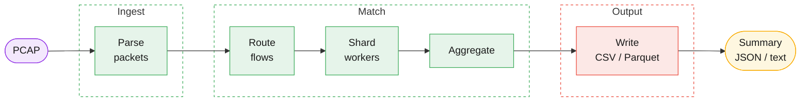
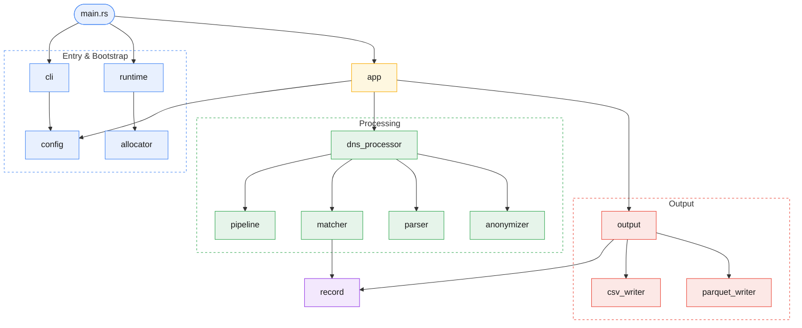

# DPP Architecture

## Scope

This document is the canonical architecture reference for the DPP Community Edition. It records the
processing model, ownership boundaries, and matcher invariants that must remain true across bug
fixes, performance work, and future refactors.

## Processing Model

DPP Community Edition has a single supported matching model:

- forward-only matching with deterministic ordering by `(timestamp_micros, packet_ordinal)`
- offline processing from PCAP file input or EOF-terminated stdin PCAP streams into CSV or Parquet output
- optional final JSON run summary through the canonical report-format contract; stdout export mode
  is CSV-only, rejects JSON reports, suppresses text reports, treats downstream stdout pipe
  closure as graceful CLI termination, suppresses broken-pipe log noise if stderr itself is closed,
  and signal-driven shutdown drops any still-buffered output tail before final writer teardown
- optional `--monotonic-capture` mode for globally ordered captures

The matcher is the authoritative owner of in-flight query/response state. Parsing may run in
parallel, but matching decisions must be applied in a deterministic order.

```mermaid
flowchart LR
    PCAP(["PCAP"]):::input

    subgraph Ingest [" Ingest "]
        Parse["Parse\npackets"]:::proc
    end

    subgraph Match [" Match "]
        Route["Route\nflows"]:::proc
        Shards["Shard\nworkers"]:::proc
        Agg["Aggregate"]:::proc
    end

    subgraph Output [" Output "]
        Write["Write\nCSV / Parquet"]:::out
    end

    Summary(["Summary\nJSON / text"]):::orch

    PCAP --> Parse --> Route --> Shards --> Agg --> Write --> Summary

    classDef input  fill:#f3e8fd,stroke:#9334e6,color:#1a1a1a
    classDef proc   fill:#e6f4ea,stroke:#34a853,color:#1a1a1a
    classDef out    fill:#fce8e6,stroke:#ea4335,color:#1a1a1a
    classDef orch   fill:#fef7e0,stroke:#f9ab00,color:#1a1a1a

    style Ingest fill:none,stroke:#34a853,stroke-width:1px,stroke-dasharray:4
    style Match  fill:none,stroke:#34a853,stroke-width:1px,stroke-dasharray:4
    style Output fill:none,stroke:#ea4335,stroke-width:1px,stroke-dasharray:4
```

## Pipeline

The processing pipeline has four logical stages:

1. Packet ingestion and ordering
   Reads packets from an offline PCAP file, rejects captures or packets declared with non-Ethernet
   linktypes, and establishes deterministic packet order inside each batch.

2. DNS extraction
   Parses Ethernet/IP/UDP payloads and builds DNS query/response candidates.

3. Query-response matching
   Holds in-flight query/response state, applies timeout windows, deduplicates retries, and emits
   exactly one terminal outcome per canonical query.

4. Record serialization
   Streams matched or timed-out DNS records to CSV or Parquet writers.

In the current multi-threaded implementation, those stages are realized as a bounded batch-prefetch
reader, a lightweight routing stage, shard-owned workers, a deterministic aggregator, and
asynchronous writers. The routing stage performs only cheap L3/L4 extraction, computes a canonical
client/resolver flow key, and hands owned packet batches to the correct worker before full DNS
decode begins. DPP derives its execution budget from available CPUs, capped by `--threads` or
`DPP_THREADS` when specified. On low-core budgets, DPP falls back to the simpler phase-parallel
pipeline so it does not spend too much of the machine on staged-pipeline service roles. In staged
mode, the runtime reserves two non-worker service threads for routing/aggregation and parser work,
and uses the remaining CPU budget for shard workers. Routed DNS packets also carry compact UDP/DNS
metadata into shard workers so the worker path can reuse the first L3/L4 parse instead of
repeating it for full DNS question decoding.

Ethernet decoding also produces one canonical VLAN context: the ordered stack of tag TPIDs and
12-bit VLAN IDs. PCP and DEI are QoS metadata and do not distinguish transactions. This context is
shared by fragment keys and matcher identities, keeping overlapping IP endpoints in different
VLANs separate. Routing still uses the coarser client/resolver endpoint tuple, so different VLANs
with the same endpoints can share a worker without sharing matcher state. Untagged packets allocate
no tag storage; tagged stacks use shared immutable storage and remain internal to processing.

Flow routing buffers the existing tuple's `Hash` writes on the stack and runs SeaHash once over
the resulting bytes. The integer encoding and digest remain identical to the streaming hasher,
so shard assignment and output order are preserved. If a future tuple encoding exceeds the
buffer, routing replays its bytes into the streaming hasher; this adds no persistent flow state
or second encoding of canonical addresses and ports.

## Core Components

- `src/packet_parser.rs`
  Reads packets from offline captures and exposes them to the rest of the pipeline. Classic PCAP
  files use a pure-Rust streaming reader; regular-file PCAPNG and other non-classic formats
  currently fall back to libpcap. EOF-terminated stdin capture streams are also supported through
  parser-owned stream-native readers: classic PCAP stdin uses the same pure-Rust fast path family
  as classic file input, and PCAPNG stdin owns block framing and one section-local interface table.
  PCAPNG uses the dependency's stateless structural validation, while the parser converts raw
  high/low timestamp words using the interface's full binary/decimal resolution and signed offset.
  Conversion scales the complete counter before rounding to microseconds and saturates only the
  final signed timestamp. It never invokes the dependency's stateful timestamp conversion.
  Buffers grow with received block bytes rather than untrusted declared lengths, and stdin PCAPNG
  blocks over 16 MiB are rejected before their body is read. Stdin probing
  needs no temp-file or second ingest owner. Unsupported stdin stream magic is rejected explicitly.
  Signal-driven shutdown can interrupt a blocked stdin read without waiting for the producer to
  close the stream; capture reading remains parser-owned. Packets already read into a nonempty
  batch are handed to the processing pipeline before intake stops. The signal shutdown policy can
  still discard records buffered by the output writer.
  The pure-Rust classic-PCAP reader still relies on the upstream `pcap-file` `3.0.0-rc1` release
  candidate until a stable line with the required functionality is available.
  The parser can also enforce globally monotonic capture timestamps for the optional batched
  timeout-eviction path; when that contract is enabled, a timestamp regression becomes a hard
  processing error instead of a post-run warning.

- `src/config.rs`
  Canonical runtime configuration and processing constants. Output format, report format, batch
  sizing, timeout windows, execution-model thresholds, and writer thresholds must have a single
  source of truth here.

- `src/allocator.rs`
  Canonical global allocator boundary. Build-time allocator selection is owned here through
  mutually exclusive Cargo features and must not leak into CLI, environment parsing, or subsystem
  configuration.

- `src/cli.rs`
  Canonical CLI and environment-resolution boundary. Command-line parsing, environment override
  precedence, and output-path validation must stay centralized here instead of leaking into runtime
  orchestration or module-local helpers.

- `src/record.rs`
  Canonical exported `DnsRecord` contract. Internal matcher discriminators and shard metadata must
  never leak into this type. Timeout records currently encode "no response observed in the match
  window" by leaving response fields absent. The canonical timeout signal is an absent
  `response_timestamp`; `response_code` is absent because no DNS response exists.

- `src/output.rs`
  Writer lifecycle boundary. Owns output control messages and the writer-thread factory. The
  handoff channel from processing to output carries batched `DnsRecord` messages and is bounded by
  configuration. User-facing capacity remains a record backlog; internally it is rounded up to
  batch-message slots. `src/config.rs` owns both the maximum records per output message and the
  default queued-record backlog, so the
  batched handoff must not become unbounded ambient state. Broken-pipe closure on stdout is treated
  as a downstream-close outcome; regular file-write failures remain fatal.

- `src/monitor_memory.rs`
  Optional RSS tracking helper with an explicit stop/join lifecycle. The monitor's 100 ms sampling
  wait is interruptible by stop, so join need not wait for the next sample. An in-progress RSS
  refresh must still finish before the monitor thread exits.

- `src/dns_processor.rs` and `src/dns_processor/*`
  The DNS processor facade owns packet-to-matcher orchestration and delegates to focused
  submodules: `anonymizer.rs` for key loading and deterministic pseudonymization, `parser.rs` for
  packet-to-DNS extraction and canonical flow routing metadata, `matcher.rs` for in-flight state
  and pairing, `pipeline.rs` for shard-parallel orchestration, and `types.rs` for internal matcher
  types. Signal-driven shutdown semantics for pending unmatched queries are also owned here:
  interrupted runs must not synthesize timeout tail records from incomplete matcher state. The
  staged pipeline may reuse parser-produced UDP/DNS metadata between routing and
  shard-local DNS decode, but that reuse must stay within the same ownership boundary so packet
  parsing does not gain a second source of truth for IP/port extraction. That metadata owns the
  exact DNS byte range validated against IPv4 Total Length or IPv6 Payload Length and then UDP
  Length; capture padding and trailing IP payload cannot extend the DNS slice. For an opted-in
  first IPv4 response fragment, the DNS slice ends at that fragment's Total Length, and the UDP
  Length is checked against the declared datagram size. A compact relative
  offset preserves DNS starts above 65535 without widening every packet's routing metadata: the
  offset is measured from the minimum Ethernet/IPv4/UDP header length, and construction checks
  that it fits. DNS QR determines
  direction and the canonical client/resolver flow, including exchanges with UDP port 53 on both
  ends. IPv6 Hop-by-Hop, Routing, Destination Options, AH and atomic Fragment headers are traversed
  within the declared payload boundary. Non-atomic IPv6 fragments and, by default, fragmented
  IPv4 datagrams are skipped. With
  `--allow-fragments`, only a first IPv4 response fragment with a complete DNS header and question
  can enter the matcher as an inferred response; later fragments and fragmented queries remain
  skipped. Its response code is present only when there are no additional records or all declared
  DNS records fit in that prefix.
  `--full-fragments` additionally enables IPv4 reassembly across packet batches and implies
  `--allow-fragments`. The DNS processor owns the reassembly state: a complete datagram enters the
  existing UDP/DNS validation path only after the first and last fragments establish its bounds
  and every byte is present. Incomplete responses may use the first-fragment inference on capacity
  eviction or end of input; with monotonic capture, entries can also expire after the match
  timeout. Without monotonic capture, timestamp gaps between fragments of the same datagram
  do not expire it; capacity limits and end of input still bound its lifetime.
  Fragmented queries require a complete datagram. A complete datagram
  uses the final fragment's (`MF=0`) capture timestamp, while inferred responses use the first
  fragment's timestamp. While any datagram is unresolved, routing retains its ready packet
  batches so a delayed reconstruction cannot arrive after a retry or response that it should
  precede. Released packets are sorted together by timestamp and capture ordinal before matching.
  The eviction watermark cannot advance beyond either unresolved fragments or retained ready
  packets. The additional ready backlog is bounded between batches to 65,536 packets or 64 MiB
  of packet payloads; exceeding either bound resolves pending datagrams through the existing
  capacity fallback before releasing the backlog. The current input batch and fallback packets
  can temporarily exceed that retained-state bound. This buffering is owned by the routing stage
  and contains no query/response pairing state.
  The reassembler retains a bounded history of completed datagrams and
  compares the fragment key and UDP payload bytes before suppressing repeated complete datagrams
  or prefix fallback from fragments matching a recent completion. A reused IPv4 ID with different
  content can still produce a new datagram, even when its first fragment is identical. An incomplete
  new datagram whose observed fragments match a recent completion is indistinguishable from a
  duplicate and may be suppressed; the same holds for a fully identical new datagram. Reassembly
  state must remain bounded in memory, and IPv6 fragments remain unsupported. A fragmented UDP datagram must
  have an IP payload length equal to its UDP Length; mismatched fragment sets are rejected.
  When the first fragment arrives after tails, its UDP Length also bounds every retained tail;
  a nonfinal fragment cannot reach or exceed that boundary, regardless of arrival order.
  A first non-DNS UDP fragment removes any earlier tails for its datagram key. A separate bounded
  history drops later non-DNS tails without evicting the completed-DNS history; a new DNS first
  fragment with a reused IPv4 ID removes that non-DNS mark. The canonical VLAN context is part of
  the fragment key so traffic from different tagged segments is not assembled together, while
  priority or drop-eligibility changes do not split a datagram. A new DNS tail
  that arrives before its first fragment while the old non-DNS mark is active is indistinguishable
  from an old non-DNS tail and may be dropped.
  The optional runtime flag
  `--dns-wire-fast-path` may enable a custom question-only wire fast path, but `hickory` remains
  the semantic fallback for rare DNS messages that the fast path does not accept. Compression
  pointers must target prior, nonoverlapping names; enabling the fast path must not weaken that
  validation. `--max-dns-compression-jumps` (environment: `DPP_MAX_DNS_COMPRESSION_JUMPS`)
  limits each decoded name to 32 pointer transitions by default; `0` disables this resource
  limit. The limit applies to questions, scanned RR owners and TSIG algorithm names in both
  decoder modes, including partial responses and fast-path fallback. A cached suffix contributes
  its full pointer depth to this limit. Even when unlimited, strictly backward, nonoverlapping
  segments prevent cycles. This is a resource policy, not a claim that longer chains violate DNS.
  One immutable-message name decoder caches fully validated pointer targets and their encoded
  segment end, expanded wire length, pointer depth and first label. Every cache hit rechecks the
  segment end against the current name's start so a previously valid target cannot authorize an
  overlap. Only referenced suffixes are retained; ordinary flat record lists do not grow the cache
  per record. RR/TSIG name skipping validates short walks directly (up to eight jumps and 64
  literal bytes per referenced segment), switching to the shared cached walker when either
  threshold or the configured jump limit would be exceeded. These thresholds choose a cheaper
  validation strategy; they never relax the limit or accept an otherwise invalid name.
  Small caches and traversal stacks use inline storage; larger ones allocate within
  the message and are bounded by the 14-bit pointer address space. Label materialization skips
  pointer-only segments. Compressed questions are passed to Hickory already expanded, avoiding
  a second recursive traversal without replacing Hickory's question semantics. Literal-root
  validation for OPT remains distinct from a compressed name that expands to root.
  The optional fast path keeps a single-pass formatter for uncompressed questions; seeing a
  pointer restarts validation at the original name offset through the shared cached decoder.
  For ordinary QUERY messages (OPCODE 0), more than one question is rejected under
  RFC 9619. A complete response cannot claim answer or authority records that are absent from its DNS
  payload, whether or not it has additional records. TSIG status extraction consumes and
  bounds-checks the declared Other Data, including the six-byte server time in BADTIME responses.
  Both paths accept
  decompressed wire QNAMEs up to the RFC 1035 limit of 255 octets, including label-length octets and
  the terminating root octet. A valid name can expand to 1003 bytes in escaped presentation form
  and must remain distinct through matching and export. If any QNAME exceeds the wire limit, the
  parser rejects the whole DNS message before the matcher and increments
  `oversized_qname_message_count` once. This counter's unit is rejected DNS messages, not questions;
  partial questions from such a message must never reach matcher state or output. The optional
  `--monotonic-capture` contract enables batched timeout eviction inside shard-local matcher state,
  but only under a strict globally monotonic timestamp assumption. When that contract is active,
  the eviction watermark comes from the routed batch maximum timestamp, not from each shard's local
  maximum, so sparse shards still retire stale state against the global batch frontier. The
  Community Edition scope is currently limited to DNS over UDP port 53.

- `src/csv_writer.rs` and `src/parquet_writer.rs`
  Consume finalized `DnsRecord` values and write them asynchronously. Writers must not become a
  second source of truth for exported record schema or pipeline policy.

- `src/app.rs`
  Top-level orchestration layer. Owns the ordered run sequence, process reporting, and shutdown
  coordination without taking ownership of canonical configuration or writer internals. Capture
  read failures drain and join complete accepted batches, skip unmatched-query finalization, flush
  conclusive records as valid partial output, and only then return the processing error. The final
  run summary is also where aggregate matching-quality metrics such as timeout ratio and average
  matched RTT are derived from authoritative processing counters. Parser rejections caused by an
  oversized decompressed QNAME are exposed as
  `metrics.dns_messages_rejected_oversized_qname` without changing their DNS-message unit.

- `src/error.rs`
  Canonical top-level error taxonomy for the application, runtime bootstrap, and output lifecycle.
  Lower-level hot-path modules may still use focused local error types or `anyhow`, but top-level
  orchestration boundaries must map failures into structured categories here.

- `src/runtime.rs`
  Bootstrap and host-runtime boundary. Logger setup, build/system reporting, optional memory
  monitoring, signal handling, and Rayon pool creation live here so CLI parsing and app
  orchestration do not carry side-effectful runtime bootstrap responsibilities directly. The logger
  remains human-readable and suppresses broken-pipe noise when stderr itself is a closed pipe;
  machine-readable final JSON reporting is selected through the canonical CLI/config contract and
  emitted from the top-level app orchestration layer.

- `src/main.rs`
  Thin entrypoint that delegates to `src/cli.rs`, `src/runtime.rs`, and `src/app.rs`, then returns
  the top-level process outcome.

- `docs/rfc/`
  Canonical architecture decision records. `README.md` is the directory index. Current RFCs
  cover ownership boundaries (0001), CLI/runtime split (0002), allocator selection (0003),
  forward-only matcher determinism (0004), dual-path PCAP parsing (0005), and adaptive
  pipeline execution (0006), and packet-storage allocation experiments (0007).

- `docs/encapsulation-playbook.md`
  Operational and engineering guidance for captures with unsupported MPLS or other outer
  encapsulation layers before the IP header. Ethernet VLAN and QinQ are decoded natively.

- `benches/README.md`
  Documents the benchmark contract, safety expectations, and result layout for repeatable runs.

- `benches/benchmark.sh`
  Repeatable benchmark scaffold for throughput and shutdown-tail measurements on caller-provided
  PCAP inputs.

- `benches/allocator-benchmarking.md`
  Canonical build matrix and measurement protocol for comparing allocator variants.

```mermaid
flowchart TD
    M(["main.rs"]):::entry

    subgraph Entry [" Entry & Bootstrap "]
        CLI["cli"]:::entry
        CFG["config"]:::entry
        RT["runtime"]:::entry
        ALLOC["allocator"]:::entry
    end

    APP["app"]:::orch

    subgraph Core [" Processing "]
        DP["dns_processor"]:::proc
        PIPE["pipeline"]:::proc
        MATCH["matcher"]:::proc
        PARSE["parser"]:::proc
        ANON["anonymizer"]:::proc
    end

    REC["record"]:::data

    subgraph Out [" Output "]
        OUTPUT["output"]:::out
        CSV["csv_writer"]:::out
        PQ["parquet_writer"]:::out
    end

    M --> CLI & RT & APP
    CLI --> CFG
    RT --> ALLOC
    APP --> CFG & DP & OUTPUT
    DP --> PIPE & MATCH & PARSE & ANON
    MATCH --> REC
    OUTPUT --> REC & CSV & PQ

    classDef entry fill:#e8f0fe,stroke:#4285f4,color:#1a1a1a
    classDef orch  fill:#fef7e0,stroke:#f9ab00,color:#1a1a1a
    classDef proc  fill:#e6f4ea,stroke:#34a853,color:#1a1a1a
    classDef data  fill:#f3e8fd,stroke:#9334e6,color:#1a1a1a
    classDef out   fill:#fce8e6,stroke:#ea4335,color:#1a1a1a

    style Entry fill:none,stroke:#4285f4,stroke-width:1px,stroke-dasharray:4
    style Core  fill:none,stroke:#34a853,stroke-width:1px,stroke-dasharray:4
    style Out   fill:none,stroke:#ea4335,stroke-width:1px,stroke-dasharray:4
```

## Current Baseline

The current accepted architecture relies on these structural choices:

- `src/config.rs`, `src/record.rs`, and `src/output.rs` remain the single sources of truth for
  runtime policy, exported record schema, and writer lifecycle.
- `src/cli.rs`, `src/runtime.rs`, and `src/app.rs` split configuration resolution, runtime
  bootstrap, and top-level orchestration into explicit boundaries.
- Matching remains forward-only and deterministic. Retry deduplication applies inside the
  configured match-timeout window and does not create extra terminal records.
- Staged execution is used only when the available CPU budget can support dedicated routing and
  aggregation service threads without starving shard workers.
- Batched timeout eviction is opt-in and valid only under a strict globally monotonic timestamp
  assumption.
- Writer threads remain asynchronous and consume only finalized records.

## Matcher Contract

The DNS matcher must preserve these invariants:

- Each observed DNS query or response candidate has a stable in-flight identity until it is matched
  or discarded.
- Routing and in-flight matching use the original observed client IP, client port, and resolver IP.
  The resolver remains internal; deterministic client-IP pseudonymization is applied exactly once
  when the matcher constructs a finalized `DnsRecord`.
- DNS ID, observed QNAME, QTYPE, QCLASS, OPCODE and the full canonical VLAN tag stack also distinguish
  in-flight identities. QCLASS, OPCODE, VLAN context and resolver identity remain internal and do
  not change the exported record schema.
- Repeated pending queries with the same match identity inside the configured timeout window
  (`1200ms` by default) are deduplicated to the earliest canonical query. Later duplicates are
  counted separately and must not create extra matched or timeout records.
- In default mode, each pending canonical query owns any retry timestamps needed to regroup
  unresolved attempts when an earlier query arrives across a batch boundary. Regrouping uses
  earliest-first timeout windows for that identity, so chains of regressions cannot transitively
  swallow attempts outside the final canonical window. Already finalized transactions are never
  reopened. Monotonic mode allocates no retry history. This adds one optional pointer per pending
  query and storage for default-mode retries; only earlier-canonical replacements regroup attempts.
- Match identity preserves the observed presentation-form QNAME bytes instead of lowercasing them.
  This is a deliberate Community Edition trade-off, not a protocol guarantee. RFC 4343 defines
  ASCII label comparison as case-insensitive, and a valid response is allowed to differ from the
  query's 0x20 casing, including when name compression reuses label bytes from another wire
  location. Community Edition still keeps byte-preserving identity because that better matches the
  real behavior it targets on offline caching-resolver workloads. Pairs that differ only by case
  may therefore fail to match even on otherwise valid DNS traffic.
- Batched timeout eviction is valid only when the input capture is globally monotonic by packet
  timestamp. In that mode, queries older than `current_watermark - match_timeout` may be emitted
  as timeouts during shard processing, and stale responses older than the same threshold may be
  discarded from in-flight state.
- Duplicate responses must remain distinguishable in matcher state until they are matched or
  discarded.
- For a fixed input PCAP and configuration, matcher decisions and emitted record order must be
  deterministic.
- Tie-breaks for equal timestamps must be explicit and stable. Scheduler interleaving and
  container iteration order are not valid tie-breaks.
- A query reaches exactly one terminal outcome: matched once or emitted once as a timeout.
- Internal sequencing metadata used only to preserve determinism must not become part of exported
  `DnsRecord` output.

## Parallelism Boundary

Parallelism is acceptable in packet ingestion and DNS extraction, where work is naturally local to
a packet. Matching state is different: it is a shared, authoritative state machine. Mixing shared
matcher mutation with worker-scheduling order makes results depend on execution timing instead of
input data.

The required boundary is:

- Parallel stages may produce candidate records.
- Matching may run in parallel only across independent shards.
- Each shard owns its own in-flight matcher state and must process candidates in deterministic
  order.
- Query and response packets that belong to the same client/resolver flow must route to the same
  shard worker before full DNS decode.
- Finalized records from shard-local processing are merged back in a deterministic order before
  they reach output writers.
- Output writers consume only finalized records.

## Notes

- Output records are not guaranteed to be globally sorted by timestamp.
- Writers remain asynchronous. Logical record order can still be deterministic even when output
  container layout, such as Parquet row-group boundaries, is not byte-identical across runs.
- IP rewriting is deterministic pseudonymization. It reduces direct exposure of source addresses,
  but identical inputs still map to identical outputs. IPv4 uses an eight-round, 32-bit Feistel
  permutation with an independently derived AES key, so distinct IPv4 addresses cannot collide.
  IPv6 retains its original AES block mapping. The IPv4 mapping changed with this algorithm;
  exports from before and after the change cannot be joined by pseudonymized IPv4 address.
- Legacy text key files retain the fixed PBKDF2 salt so existing pseudonyms remain stable across
  runs and hosts. The optional salted v2 key-file format supplies a 32-byte salt for both IPv4 and
  IPv6 key derivation. Reusing the full file keeps its mapping stable; changing the salt or
  passphrase rotates both mappings. Key loading and derivation are owned by `anonymizer.rs`.
- `docs/rfc/` and `benches/` remain the canonical references for accepted architecture decisions
  and repeatable benchmark runs.
