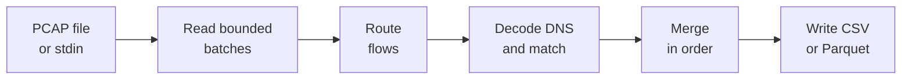
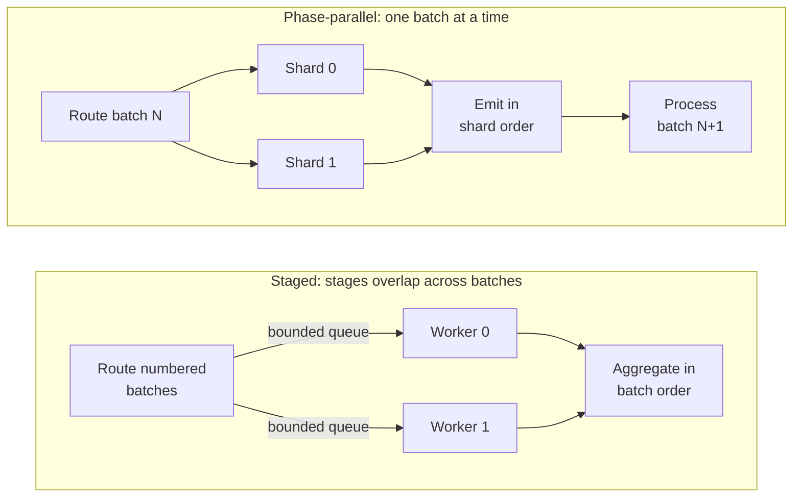
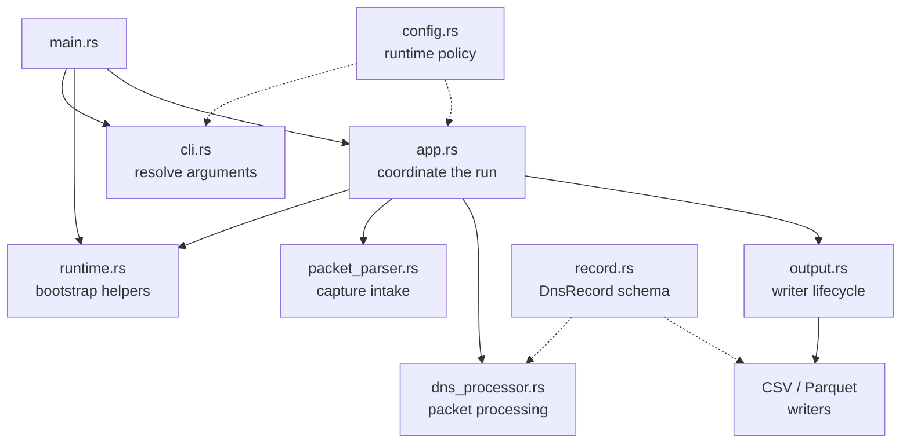
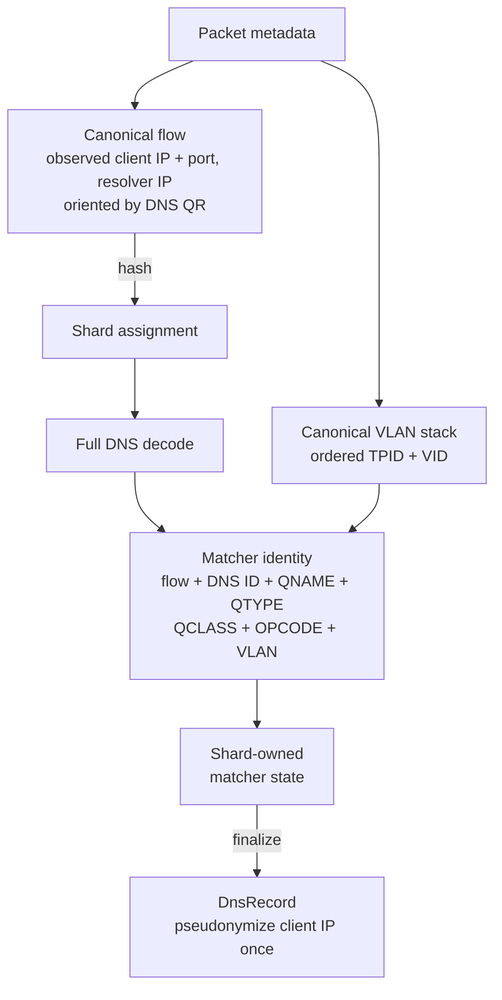
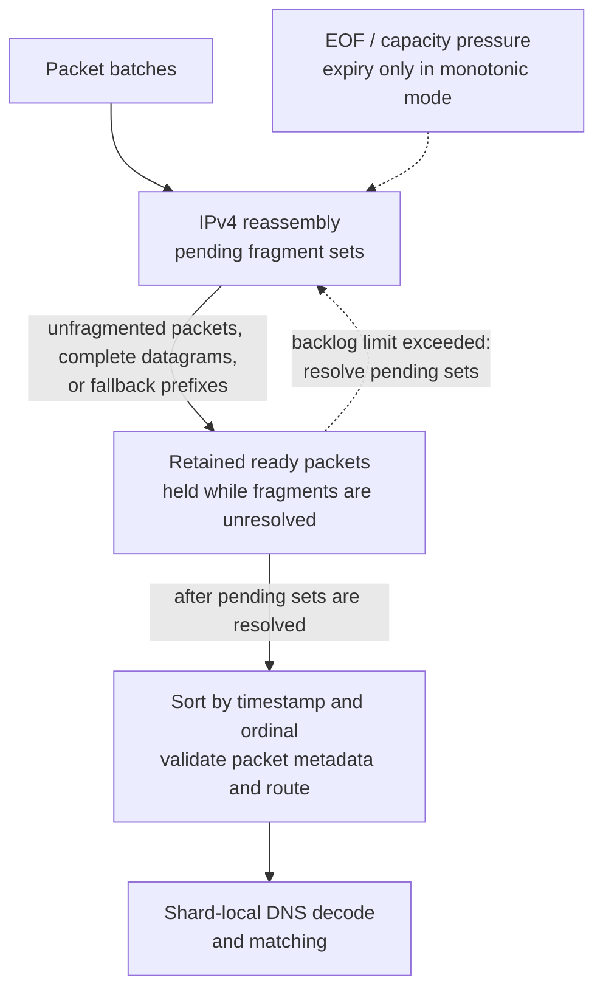

# DPP Architecture

DPP Community Edition processes offline PCAP captures into DNS transaction records in CSV or
Parquet. Its only supported matching model is forward-only: the matcher owns all in-flight
query/response state. For a fixed input and configuration, matching decisions and record order
must be deterministic, regardless of worker scheduling.

This is the canonical reference for processing, ownership, and invariants. The first two sections
give the system overview; later sections describe the contracts and edge cases.

- [Processing model](#processing-model)
- [Ownership map](#ownership-map)
- [Matcher contract](#matcher-contract)
- [Output, reporting, and shutdown](#output-reporting-and-shutdown)
- [Capture input and packet routing](#capture-input-and-packet-routing)
- [IPv4 fragmentation](#ipv4-fragmentation)
- [DNS validation](#dns-validation)
- [IP pseudonymization](#ip-pseudonymization)
- [Related references](#related-references)

## Processing model

Input is a PCAP file or an EOF-terminated stdin capture stream. DPP supports DNS over UDP port 53
on Ethernet, including VLAN and QinQ. File output supports CSV and Parquet; stdout export is CSV-only.
An optional final run summary uses the canonical text/JSON report-format contract.

The pipeline has four logical stages:

| Stage | Responsibility |
| --- | --- |
| Ingest and order | Read capture packets, reject non-Ethernet linktypes, and order packets within each batch. |
| Extract DNS | Parse Ethernet/IP/UDP payloads into query/response candidates. |
| Match | Pair queries and responses, apply timeout windows, and deduplicate retries. |
| Serialize | Stream finalized matched or timed-out records to asynchronous writers. |

In staged execution, these responsibilities are distributed as follows:

```mermaid
flowchart LR
    Input["PCAP file<br/>or stdin"] --> Read["Read bounded<br/>batches"]
    Read --> Route["Route<br/>flows"]
    Route --> Workers["Decode DNS<br/>and match"]
    Workers --> Aggregate["Merge<br/>in order"]
    Aggregate --> Write["Write CSV<br/>or Parquet"]
```

### Execution and parallelism

DPP derives its CPU budget from available CPUs, capped by `--threads` or `DPP_THREADS` when
specified. The execution model is selected automatically from that budget:

| Model | When used | How work runs |
| --- | --- | --- |
| Staged | Enough CPUs for service roles and shard workers | Reserve two non-worker roles for parsing/routing and aggregation; use the remaining budget for matcher workers. |
| Phase-parallel | Low-core budgets | Process batches in sequence, parallelize shard work within each batch, then collect results in shard order. |

The key difference is where work overlaps. These two lanes are illustrative; actual shard and
worker counts depend on the CPU budget. Each staged worker owns a range of shards.

```mermaid
flowchart TB
    subgraph Phase["Phase-parallel: one batch at a time"]
        direction LR
        Batch["Route batch N"] --> Shard0["Shard 0"]
        Batch --> Shard1["Shard 1"]
        Shard0 --> Emit["Emit in<br/>shard order"]
        Shard1 --> Emit
        Emit --> Next["Process<br/>batch N+1"]
    end
    subgraph Staged["Staged: stages overlap across batches"]
        direction LR
        Router["Route numbered<br/>batches"] -->|"bounded queue"| Worker0["Worker 0"]
        Router -->|"bounded queue"| Worker1["Worker 1"]
        Worker0 --> Aggregate["Aggregate in<br/>batch order"]
        Worker1 --> Aggregate
    end
    Phase ~~~ Staged
```

See [RFC 0006](rfc/0006-adaptive-pipeline.md) for the selection policy and thread roles.

Parallel ingestion and DNS extraction are allowed. Matching may run in parallel only across
independent shards, and **each shard exclusively owns its matcher state**. Query and response
packets in the same client/resolver flow must reach the same worker before full DNS decode.
Each shard processes candidates in deterministic order, and the aggregator
merges finalized records deterministically before handing them to writers. Scheduler interleaving
and container iteration order must never decide a tie.

## Ownership map

Each boundary has one authoritative owner. In particular, configuration, exported record schema,
and writer lifecycle must not acquire a second source of truth.

This map shows selected responsibilities: solid arrows mean delegation, dotted arrows mean use
of a canonical contract. It is not a call-order or exhaustive dependency diagram.

```mermaid
flowchart TB
    Main["main.rs"] --> CLI["cli.rs<br/>resolve arguments"]
    Main --> Runtime["runtime.rs<br/>bootstrap helpers"]
    Main --> App["app.rs<br/>coordinate the run"]
    App --> Runtime
    App --> Capture["packet_parser.rs<br/>capture intake"]
    App --> DNS["dns_processor.rs<br/>packet processing"]
    App --> Output["output.rs<br/>writer lifecycle"]
    Output --> Writers["CSV / Parquet<br/>writers"]
    Config["config.rs<br/>runtime policy"] -.-> CLI
    Config -.-> App
    Record["record.rs<br/>DnsRecord schema"] -.-> DNS
    Record -.-> Writers
```

| Owner | Responsibility |
| --- | --- |
| [`main.rs`](../src/main.rs) | Thin entrypoint: compose CLI, runtime, and app; return the process outcome. |
| [`cli.rs`](../src/cli.rs) | CLI parsing, environment precedence, and output-path validation. |
| [`config.rs`](../src/config.rs) | Runtime policy: output/report formats, batch sizes, timeouts, execution thresholds, and writer thresholds. |
| [`runtime.rs`](../src/runtime.rs) | Logger setup, build/system reporting, signal handling, optional memory monitoring, and Rayon pool creation. |
| [`app.rs`](../src/app.rs) | Ordered run orchestration, final reporting, and shutdown coordination. |
| [`allocator.rs`](../src/allocator.rs) | Global allocator selection through mutually exclusive build-time Cargo features; no CLI or runtime allocator policy. |
| [`packet_parser.rs`](../src/packet_parser.rs) | Capture readers, packet batches, capture timestamps, and interruptible stdin intake. |
| [`dns_processor.rs`](../src/dns_processor.rs) | Packet-to-matcher orchestration and the interrupted-run policy for pending queries. |
| [`record.rs`](../src/record.rs) | Exported `DnsRecord` schema; internal matcher discriminators and sequencing metadata stay out. |
| [`output.rs`](../src/output.rs) | Writer factory, lifecycle, and output control messages. |
| [`csv_writer.rs`](../src/csv_writer.rs), [`parquet_writer.rs`](../src/parquet_writer.rs) | Asynchronous serialization of finalized records; no ownership of schema or pipeline policy. |
| [`monitor_memory.rs`](../src/monitor_memory.rs) | Optional RSS sampling with explicit stop/join. |
| [`error.rs`](../src/error.rs) | Structured top-level application, bootstrap, and output errors. Hot-path modules may use local errors or `anyhow`, mapped at orchestration boundaries. |

The DNS processor delegates within its boundary:

| Submodule | Responsibility |
| --- | --- |
| [`parser.rs`](../src/dns_processor/parser.rs) | Packet-to-DNS extraction and canonical flow-routing metadata. |
| [`name_decoder.rs`](../src/dns_processor/name_decoder.rs) | Shared DNS name validation and compression traversal. |
| [`reassembly.rs`](../src/dns_processor/reassembly.rs) | Bounded IPv4 fragment reassembly. |
| [`matcher.rs`](../src/dns_processor/matcher.rs) | Authoritative in-flight query/response state and pairing. |
| [`pipeline.rs`](../src/dns_processor/pipeline.rs) | Shard-parallel routing, processing, and aggregation. |
| [`anonymizer.rs`](../src/dns_processor/anonymizer.rs) | Key loading, derivation, and deterministic IP pseudonymization. |
| [`types.rs`](../src/dns_processor/types.rs) | Internal matcher types. |

## Matcher contract

### Identity and routing

Every query or response candidate has a stable in-flight identity until matched or discarded.
Identity includes:

- original observed client IP and port, plus resolver IP;
- DNS ID, observed presentation-form QNAME, QTYPE, QCLASS, and OPCODE;
- the full canonical VLAN tag stack.

Routing uses the coarser client/resolver flow tuple. Different VLANs with the same endpoints can
share a worker, but cannot share matcher state. Resolver identity, QCLASS, OPCODE, and VLAN context
remain internal and do not extend `DnsRecord`.

The diagram separates **where a packet goes** from **which transaction it belongs to**. VLAN
context contributes to matcher identity, not the flow hash.

```mermaid
flowchart TB
    Packet["Packet metadata"] --> Flow["Canonical flow<br/>observed client IP + port, resolver IP<br/>oriented by DNS QR"]
    Packet --> VLAN["Canonical VLAN stack<br/>ordered TPID + VID"]
    Flow -->|"hash"| Shard["Shard assignment"]
    Shard --> Decode["Full DNS decode"]
    Decode --> Identity["Matcher identity<br/>flow + DNS ID + QNAME + QTYPE<br/>QCLASS + OPCODE + VLAN"]
    VLAN --> Identity
    Identity --> State["Shard-owned<br/>matcher state"]
    State -->|"finalize"| Record["DnsRecord<br/>pseudonymize client IP once"]
```

Client-IP pseudonymization happens exactly once, when the matcher constructs a finalized record.
Routing and matching always use the original addresses.

**QNAME identity is byte-preserving and case-sensitive.** This is a deliberate Community Edition
trade-off for offline caching-resolver workloads. RFC 4343 defines ASCII label comparison as
case-insensitive, and valid responses may differ in 0x20 casing, including through compression.
Such pairs may fail to match in Community Edition; byte-preserving identity is not a protocol
guarantee.

### Retries and terminal outcomes

Repeated pending queries with the same identity inside the match-timeout window (`1200ms` by
default) belong to the earliest canonical query. Later duplicates are counted separately and must
not create extra matched or timeout records. Duplicate responses remain distinguishable until
matched or discarded.

In default mode, the pending canonical query owns retry timestamps needed when an earlier query
arrives across a batch boundary. The matcher regroups unresolved attempts into earliest-first
timeout windows; chains of timestamp regressions must not absorb attempts outside the final
canonical window. Finalized transactions are never reopened.

Retry history adds one optional pointer per pending query and storage for default-mode retries.
Only earlier-canonical replacements regroup attempts. Monotonic mode allocates no retry history.

On normal completion, each canonical query has one terminal outcome: matched once or emitted once
as a timeout. Interrupted and failed runs have a separate [shutdown policy](#output-reporting-and-shutdown)
and must not invent timeout records from incomplete matcher state.

### Ordering and timeout eviction

For a fixed input PCAP and configuration, matching decisions and emitted record order must be
deterministic. Packet ordering uses `(timestamp_micros, packet_ordinal)`; candidate tie-breaks within
a shard also include `record_ordinal`. Internal sequencing metadata never enters `DnsRecord`.

Deterministic order does **not** imply globally timestamp-sorted output. Asynchronous output
container layout, such as Parquet row-group boundaries, need not be byte-identical across runs.

`--monotonic-capture` enables batched timeout eviction under a strict globally monotonic capture
timestamp contract:

- A timestamp regression is a hard processing error rather than a post-run warning.
- The watermark comes from the routed batch maximum timestamp, not a shard's local maximum, so
  sparse shards retire stale state against the global frontier.
- Queries older than `watermark - match_timeout` may be emitted as timeouts; stale responses older
  than that threshold may be discarded.
- Unresolved fragments and retained ready packets cap the watermark, as described under
  [reassembly ordering](#reassembly-ordering-and-memory).

See [RFC 0004](rfc/0004-forward-only-matcher.md) for matcher design and trade-offs.

## Output, reporting, and shutdown

### Records and writer handoff

Writers receive only finalized `DnsRecord` values. A timeout means “no response observed in the
match window”: `response_timestamp` is absent, and `response_code` is absent because no DNS
response exists. The absent response timestamp is the canonical timeout signal.

Processing sends bounded batches of records to output. User-facing channel capacity is a record
backlog, rounded up internally to batch-message slots. `config.rs` owns both the maximum records
per message and the default queued-record backlog; this handoff must remain bounded.

### Reports and stdout

`app.rs` derives summary metrics, including timeout ratio and average matched RTT, from
authoritative processing counters. Oversized-QNAME rejections appear as
`metrics.dns_messages_rejected_oversized_qname`, measured in rejected DNS messages.

Final JSON reporting uses the CLI/config report-format contract. Runtime logging remains
human-readable. Stdout export is CSV-only, rejects JSON reports, and suppresses text reports.
If stderr itself is a closed pipe, the logger suppresses broken-pipe noise.

### Completion and failure handling

| Event | Required behavior |
| --- | --- |
| Capture read failure | Drain and join complete accepted batches, skip unmatched-query finalization, flush conclusive records as valid partial output, then return the processing error. |
| Signal-driven shutdown | Interrupt blocked stdin intake without waiting for producer EOF. Hand packets already read into a nonempty batch to processing; do not synthesize unmatched-query timeout tails. Discard still-buffered writer output before final teardown. |
| Downstream stdout pipe closes | Treat broken pipe as a downstream-close outcome and terminate the CLI gracefully. |
| Regular file-write failure | Return a fatal error. |
| Staged worker startup failure | Release input and result channels, then join every successfully started worker before returning the startup error; cleanup must not require an aggregator. |
| Normal staged teardown | Join every worker even if an earlier worker errors or panics. Preserve any parser-stage error first, otherwise the first worker error. |

If processing failure and a signal coincide, processing failure takes precedence and the writer
flushes already buffered records.

The optional RSS monitor has an explicit stop/join lifecycle. Stop interrupts its 100ms sampling
wait, so joining need not wait for the next sample; an in-progress RSS refresh must still finish.

## Capture input and packet routing

### Capture readers

Capture reading stays in `packet_parser.rs`, including stdin probing and framing. Stdin requires
neither a temporary file nor a second ingest owner. Unsupported stdin magic and captures or
packets declared with non-Ethernet linktypes are rejected explicitly.

| Input | Reader |
| --- | --- |
| Classic PCAP file | Pure-Rust streaming reader. |
| Regular-file PCAPNG and other non-classic formats | libpcap fallback. |
| Classic PCAP stdin | Stream-native reader from the same pure-Rust fast-path family. |
| PCAPNG stdin | Parser-owned block framing and one section-local interface table. |

The pure-Rust classic-PCAP reader relies on `pcap-file` `3.0.0-rc1` until a stable release with the
required functionality is available.

PCAPNG stdin uses the dependency's stateless structural validation, but **the parser owns timestamp
conversion**. It combines raw high/low timestamp words with the interface's full binary/decimal
resolution and signed offset, scales the complete counter before rounding to microseconds, and
saturates only the final signed timestamp. It never uses the dependency's stateful conversion.

Buffers grow with received bytes, not untrusted declared lengths. Stdin PCAPNG blocks over 16MiB
are rejected before reading their body. See [RFC 0005](rfc/0005-dual-path-pcap-parsing.md) for reader
selection and monotonic timestamps.

### Ethernet and VLAN context

Ethernet decoding produces one canonical VLAN context: the ordered stack of tag TPIDs and 12-bit
VLAN IDs. PCP and DEI are QoS metadata and do not distinguish transactions. Fragment keys and
matcher identities share this context, keeping overlapping endpoints in different VLANs separate.

Untagged packets allocate no tag storage. Tagged stacks use shared immutable storage and stay
internal to processing. Unsupported outer encapsulation, such as MPLS, is covered by the
[encapsulation playbook](encapsulation-playbook.md).

### Routing metadata and hashing

Routing performs cheap L3/L4 extraction, computes the canonical client/resolver flow key, and sends
owned batches to workers before full DNS decode. DNS QR determines direction, including when both
UDP ports are 53.

Compact UDP/DNS metadata lets workers reuse the first parse. It stays within the DNS processor's
ownership boundary so IP/port extraction has one source of truth. The metadata owns the exact
validated DNS byte range: IPv4 Total Length or IPv6 Payload Length bounds it first, then UDP Length.
Capture padding and trailing IP payload cannot extend the DNS slice.

A compact relative offset supports DNS starts above 65535 without widening every packet's routing
metadata. It is measured from the minimum Ethernet/IPv4/UDP header length and checked to fit during
construction.

Flow hashing buffers the tuple's existing `Hash` writes on the stack and runs SeaHash once over
those bytes. Integer encoding and digest remain identical to the streaming hasher, preserving
shard assignment and output order. If the encoding outgrows the buffer, routing replays its bytes
into the streaming hasher. This adds neither persistent flow state nor another canonical address
and port encoding.

### IPv6 extension headers

Hop-by-Hop, Routing, Destination Options, AH, and atomic Fragment headers are traversed within
the declared IPv6 payload boundary. Non-atomic IPv6 fragments are skipped; IPv6 reassembly is
unsupported.

## IPv4 fragmentation

### Supported modes

| Mode | Behavior |
| --- | --- |
| Default | Skip fragmented IPv4 datagrams. |
| `--allow-fragments` | Allow inference from a first IPv4 response fragment containing a complete DNS header and question. Skip later fragments and fragmented queries. |
| `--full-fragments` | Reassemble IPv4 across batches; implies `--allow-fragments`. Fragmented queries require complete reassembly. |

For an inferred response, the DNS slice ends at the first fragment's Total Length; UDP Length is
checked against the declared datagram size. A response code is present only if there are no
additional records or all declared DNS records fit in the prefix.

### Reassembly and fallback

The DNS processor owns reassembly state. A complete datagram reaches the existing UDP/DNS
validation path only after the first and last fragments establish its bounds and every byte is
present. Its IP payload length must equal UDP Length; mismatched fragment sets are rejected.
When the first fragment arrives after tails, its UDP Length also bounds every retained tail.
A nonfinal fragment must end before that boundary, regardless of arrival order.

Incomplete responses may fall back to first-fragment inference on capacity eviction or EOF.
With monotonic capture, entries can also expire after the match timeout. Without it, timestamp
gaps between fragments of the same datagram do not expire the entry; capacity and EOF still bound
its lifetime.

- Complete datagrams use the final fragment's (`MF=0`) capture timestamp.
- Inferred responses use the first fragment's timestamp.

### Reassembly ordering and memory

With `--full-fragments`, reassembly and the ready backlog sit before shard-local matching. The
arrows below show packet flow; dotted arrows show events that can resolve pending fragment sets.
Fallback supplies candidate prefixes, which still pass through UDP/DNS validation and may produce
no record.

```mermaid
flowchart TB
    Input["Packet batches"] --> Reassembly["IPv4 reassembly<br/>pending fragment sets"]
    Resolve["EOF / capacity pressure<br/>expiry only in monotonic mode"] -.-> Reassembly
    Reassembly -->|"unfragmented packets, complete datagrams,<br/>or fallback prefixes"| Ready["Retained ready packets<br/>held while fragments are unresolved"]
    Ready -.->|"backlog limit exceeded:<br/>resolve pending sets"| Reassembly
    Ready -->|"after pending sets are resolved"| Route["Sort by timestamp and ordinal<br/>validate packet metadata and route"]
    Route --> Match["Shard-local DNS decode<br/>and matching"]
```

While any datagram remains unresolved, routing retains ready packet batches. This prevents a
delayed reconstruction from arriving after a retry or response it should precede. Released packets
are sorted together by timestamp and capture ordinal before matching. The eviction watermark cannot
advance beyond unresolved fragments or retained ready packets.

The additional ready backlog is bounded **between batches** to 65,536 packets or 64MiB of packet
payloads. Exceeding either limit resolves pending datagrams through capacity fallback before
releasing the backlog. The current input batch and fallback packets may temporarily exceed the
retained-state bound. Routing owns this buffer; it contains no query/response pairing state.

### Duplicate history and reused IPv4 IDs

Reassembly keeps a bounded history of completed datagrams. Fragment keys and UDP payload bytes
are compared before suppressing repeated complete datagrams or prefix fallback matching a recent
completion. A reused IPv4 ID with different content can form a new datagram, even if its first
fragment is identical. An incomplete new datagram whose observed fragments match a recent
completion is indistinguishable from a duplicate and may be suppressed, as may a fully identical
new datagram.

A first non-DNS UDP fragment removes earlier tails for its key. A separate bounded history drops
later non-DNS tails without evicting completed-DNS history. A new DNS first fragment with a reused
IPv4 ID removes that mark. A DNS tail arriving before its first fragment while the old mark is
active is indistinguishable from an old non-DNS tail and may be dropped.

The canonical VLAN context is part of each fragment key: different tagged segments cannot be
assembled together, while PCP or DEI changes do not split a datagram. All reassembly state must
remain bounded in memory.

## DNS validation

### Decoder paths and message boundaries

`--dns-wire-fast-path` enables an optional custom question-only decoder. Hickory remains the
semantic fallback for messages the fast path does not accept. Both paths preserve these rules:

- Ordinary QUERY messages (OPCODE 0) with more than one question are rejected under RFC 9619.
- Complete responses cannot claim answer or authority records absent from the payload, whether
  or not they contain additional records.
- TSIG status extraction consumes and bounds-checks declared Other Data, including the six-byte
  server time in BADTIME responses.
- OPT requires a literal root name; a compressed name that expands to root is distinct.

### QNAME size

Both decoder paths accept decompressed wire QNAMEs up to the RFC 1035 limit of **255 octets**,
including label-length octets and the terminating root. A valid name can expand to **1003 bytes**
in escaped presentation form and must remain distinct through matching and export.

If any QNAME exceeds the wire limit, reject the whole DNS message before matching and increment
`oversized_qname_message_count` once. The counter measures rejected messages, not questions;
partial questions from that message must never enter matcher state or output.

### Compression safety and resource limits

Compression pointers must target prior, nonoverlapping names. The fast path must not weaken that
validation.

`--max-dns-compression-jumps` (`DPP_MAX_DNS_COMPRESSION_JUMPS`) limits each decoded name to 32 pointer
transitions by default; `0` disables the resource limit. It applies to questions, scanned resource
record (RR) owners, and TSIG algorithm names in both decoder modes, including partial responses
and fast-path fallback. Cached suffixes contribute their full pointer depth.

This is a resource policy, not a claim that longer chains violate DNS. Even with no jump limit,
strictly backward, nonoverlapping segments prevent cycles.

### Shared name decoder

One decoder per immutable message caches fully validated pointer targets with their encoded
segment end, expanded wire length, pointer depth, and first label. Every cache hit rechecks the
segment end against the current name's start, so a previously valid target cannot authorize an
overlap. Only referenced suffixes are retained; flat record lists do not grow the cache per record.

RR/TSIG name skipping validates short walks directly: up to eight jumps and 64 literal bytes per
referenced segment. If either threshold or the configured jump limit would be exceeded, it uses
the shared cached walker. These thresholds choose a cheaper validation strategy; they do not
relax limits or accept invalid names.

Small caches and traversal stacks use inline storage; larger ones allocate within the message,
bounded by the 14-bit pointer address space. Label materialization skips pointer-only segments.
Compressed questions reach Hickory already expanded, avoiding a second recursive traversal while
retaining Hickory's question semantics.

The fast path uses a single-pass formatter for uncompressed questions. On seeing a pointer, it
restarts validation at the original name offset through the shared cached decoder.

## IP pseudonymization

`anonymizer.rs` owns key loading and derivation. Rewriting reduces direct exposure of source
addresses, but is deterministic: identical inputs still map to identical outputs.

- **IPv4:** an eight-round, 32-bit Feistel permutation with an independently derived AES key.
  Distinct IPv4 addresses cannot collide. This algorithm changed the IPv4 mapping; exports from
  before and after that change cannot be joined by pseudonymized IPv4 address.
- **IPv6:** retains its original AES block mapping.

Legacy text key files retain the fixed PBKDF2 salt, keeping existing pseudonyms stable across runs
and hosts. The optional salted v2 format supplies a 32-byte salt for both IPv4 and IPv6 derivation.
Reusing the full key file preserves its mapping; changing either salt or passphrase rotates both
mappings.

## Related references

| Reference | Use it for |
| --- | --- |
| [RFC index](rfc/README.md) | Accepted architecture decisions and their rationale; canonical list of RFCs. |
| [Encapsulation playbook](encapsulation-playbook.md) | Preparing captures with unsupported outer encapsulation. |
| [Benchmark contract](../benches/README.md) | Safety expectations, repeatable runs, and result layout. |
| [Benchmark scaffold](../benches/benchmark.sh) | Throughput and shutdown-tail measurements on caller-provided PCAP inputs. |
| [Allocator benchmarking](../benches/allocator-benchmarking.md) | Canonical allocator build matrix and measurement protocol. |
